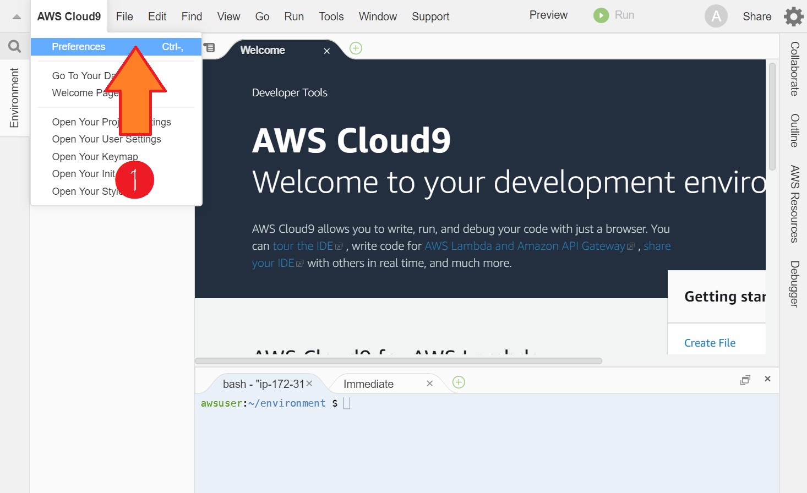
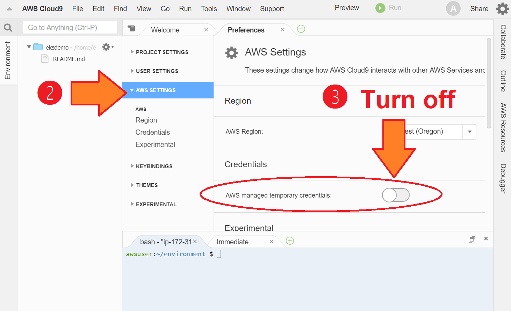

# Run the Workshop on Amazon EKS (Elastic Kubernetes Service)

This page shows you how to run the workshop on [Elastic Kubernetes Service](https://aws.amazon.com/eks/) (EKS), a managed Kubernetes environment provided by [Amazon Web Services](https://aws.amazon.com/) (AWS).


## Preparing AWS account and permissions

If you're an experienced AWS user, just skip this section.

If you're new to the AWS, do the following steps before attending the workshop:

1. Apply for a personal account in [AWS](https://aws.amazon.com/).

2. [Create an IAM user](https://console.aws.amazon.com/iam/home?/users#/users) with "AdminstratorAccess" permission, and note the "access key ID" and "secret access key" fields.

3. Get familiar with [Cloud9](https://aws.amazon.com/cloud9/) environment.

Detailed screenshots can be found [here](http://bit.ly/eks-workshop-note).


## Setting Cloud9 and credentials

1. Create a new Cloud9 environment ([at `us-west-2`](https://us-west-2.console.aws.amazon.com/cloud9/home?region=us-west-2) to save money).


2. Turn off temporary Cloud9 credentials (AWS Cloud9 / Preferences / AWS SETTINGS / Credentials / AWS managed temporary credentials).






3. Check if credential is turned off:

   ```
   % aws sts get-caller-identity
   Unable to locate credentials. You can configure credentials by running "aws configure".
   ```

4. Set credential with admin permission:

   ```
   % aws configure
   AWS Access Key ID: paste_your_real_access_key_id_here
   AWS Secret Access Key: paste_your_real_secret_access_key_here
   Default region name: us-west-2
   Default output format [None]:
   $
   ```

5. Re-check the credential:

   ```
   % aws sts get-caller-identity
   {
       "Account": "123456789012",
       "UserId": "ABCDEFGHIJKLMNOPRSTUV", 
       "Arn": "arn:aws:iam::123456789012:user/username"
   }
   ```


## Preparing for Kubernetes Cluster

1. Clone the repo of this workshop:

   ```
   % git clone https://github.com/William-Yeh/workshop-k8s201909-eks.git
   % cd workshop-k8s201909-eks
   ```

2. Install some command line tools:

   ```
   % eks-steps/install-cli.sh
   ```

3. Create a k8s cluster. This may take about 15 minutes. Be patient!

   ```
   % eksctl create cluster -f eks-steps/cluster.yml
   ``` 

4. Check if successful:

   ```
   % kubectl get nodes
   ``` 


Now you're ready to run the workshop on EKS!


## Clean up

After the workshop, clean up the eks cluster by:

```
% eksctl delete cluster  the_name_of_eks_cluster
```


Also be sure to visit the following places and clean up resources manually, if necessary:

- CloudFormation
- EKS
- ECR
- EC2 / Load Balancers


## References

Read the following articles and slides for more details about settup up EKS:

- In short: "[HashiCorp Vault Workshop：幫 Credentials 找個窩](https://www.slideshare.net/smalltown20110306/hashicorp-vault-workshop-credentials)" pp. 7--18 by smalltown.

- In full: "[Create your EKS Cluster with eksctl](https://github.com/pahud/amazon-eks-workshop/blob/master/00-getting-started/create-eks-with-eksctl.md)" by pahud.
